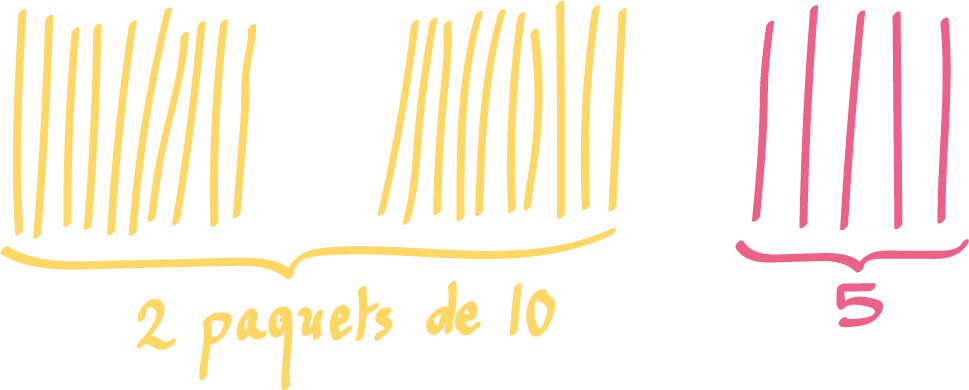
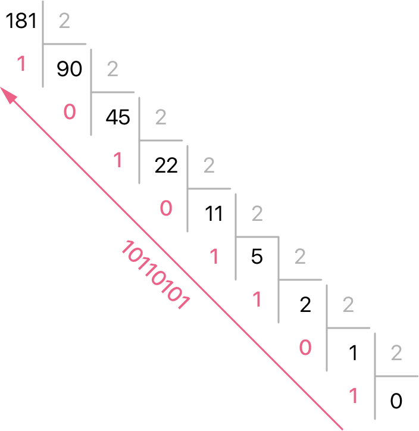

# Représentation des entiers

## Introduction

Un ordinateur ne manipule que des 0 et des 1. Que cela soit un nombre, du texte, une image, une vidéo etc. toutes ces données sont représentées par les systèmes informatiques comme des suites de 0 et de 1. 

## La base de la base

La sédentarisation fut un bouleversement profond de nos sociétés. Il fallait maintenant par exemple gérer des stocks et des flux de nourriture et répartir des superficies aux agriculteurs. D'où la nécessité de compter les grains, les hommes, les bêtes et la superficie des champs, c'est la naissance des nombres et des mathématiques.

Qu'est-ce qu'un nombre finalement ? Si cette question pourrait nous emmener dans les tréfonds de la théorie des ensembles en mathématiques, il est plutôt usuel de définir un nombre comme **une valeur arithmétique représentant une certaine quantité**. Il ne faut pas confondre un nombre (sa véritable valeur) et sa représentation (comment on l'écrit symboliquement) ! 


Une première représentation d'un nombre naturel serait d'aligner bêtement des traits. Hélas, cela devient vite fastidieux pour l'écriture de grands nombres. Deux idées : former des paquets et définir des symboles, les **chiffres**, pour compter les unités. Regroupons nos bâtons en paquet de 10 :



$$
(25)_{10} = 2 \times 10 + 5
$$

<!-- 
!!! note
    La position de chaque chiffre dans l'écriture du nombre correspond à la puissance de 10 par laquelle on le multiplie. -->

Puis le raisonnement se poursuit, si le nombre de paquets est trop grand, on regroupe les paquets par paquets de 10, ce sont les centaines. Et on poursuit ce raisonnement pour les millers, les dizaines de milliers etc.

<!-- Ainsi, on représente aujourd'hui un nombre par une **suite** de symboles, les **chiffres**.  -->

Le nombre de chiffres utilisé définit la **base** utilisé, c'est aussi choisir la « taille » du paquet. La **base décimale**, la base 10, utilise 10 chiffres : 0, 1, 2, 3, ..., 9. Suivant la notation d'agrégation de ces symboles (la **numération positionnelle**), il s'en suit cette **décomposition** : 

$$
(275)_{10} = 2 \times 100 + 7 \times 10 + 5 \times 1
$$

On préfèra la notation avec des puissances de 10 (la base) :

$$
(8275)_{10} = 8 \times 10^3 + 2 \times 10^2 + 7 \times 10^1 + 5 \times 10^0
$$

!!! note "À retenir" 
    En base décimale, la position de chaque chiffre dans l'écriture du nombre correspond à la puissance de 10 par laquelle on le multiplie.

Mais que se passerait-il s'il on avait un chiffre de moins ? La base 9 !

$$
(275)_{9} = 2 \times 9^2 + 7 \times 9^1 + 5 \times 9^0 = (230)_{10}
$$

Plus généralement, un nombre $N$ définit par la séquence de $n$ chiffres $(c_0, c_1, \ldots c_{n-1})$ (on peut définir une séquence infini en posant $c_i = 0$ pour $i \geq n$) dans sa base $B$ se décompose comme :
$$
N_B = c_0 \cdot B^0 + c_1 \cdot B^1 + \ldots + c_{n-1} \cdot B^{n-1}
$$
Ou dans sa formulation plus compact :
$$
N_B = \sum_{i = 0}^{n-1} c_i B^i
$$
Un nombre dans la base 2 (la plus petite des bases), la base **binaire**, n'utilise donc que 2 chiffres, 0 et 1, appelés **bit** (pour *binary digit* en anglais), ou booléen, ou encore chiffre binaire. C'est cette base que tout système informatique utilise.

!!! note "À retenir" 
    Pour passer d'un nombre d'une base quelconque vers la base décimale, on le décompose puis on fait le calcul normalement.

!!! Example "Exercices"
    Convertir ces nombres en base décimale :

    * $(131)_6$

    * $(420)_5$

    * $(1515)_8$

    * $(716)_4$

    * $(321)_4$


## La base binaire (base 2)

### Pourquoi la base binaire en informatique ?

Un système informatique utilise différents phénomènes physiques pour manipuler, transmettre ou mémoriser une information codée en base binaire suivant donc deux états :

* Courant électrique : Tension nulle ou tension non nulle.

* Aimantation : Aimantation dans un sens ou dans l'autre.

* Lumière : Lumière ou pas de lumière.

* etc.

Cette simplicité a un grand avantage, sa fiabilité. En effet, il est plus facile de distiguer deux valeurs dans des signaux analogiques (une tension électrique par exemple) bruités. De plus, la sobriété de l'arithmétique en binaire (addition, soustraction etc.) permet l'élaboration de circuits électroniques moins complexes. 

!!! info "Anecdote"
    En 1958, Les soviétiques ont développé un ordinateur ternaire, le Setun, qui s'est avéré plus rapide, plus fiable, plus durable et moins gourmand en énergie. Hélas, ce projet de 7 ans fut considéré comme un caprice d'universitaires et delaissé au profit des systèmes binaires.

### Compter en binaire

| Base 10  | Base 2  | 
| ---------------: |---------------:|
| 0  | 0 |
| 1  | 1 |  
| 2  | 10  |  
| 3  | 11 |  
| 4  | 100 |  
| 5  | 101 |  
| 6  | 110 |  
| 7  | 111 |  
| 8  | 1000 |  
| 9  | 1001 |  
| 10  | 1010 |  
| 11  | 1011 |  
| 12  | 1100 |  

* avec 1 bit on peut coder 2 valeurs (0 et 1)

* avec 2 bits on peut coder 4 valeurs (00, 01, 10 et 11)

* avec 3 bits on peut coder 8 valeurs (000, 001, 010, 011, 100, 101, 110, 111)
 
* avec $n$ bits on peut coder... $2^n$ valeurs (dont le nombre maximal serait $2^n - 1$)

!!! question
    Jusqu'à combien peut-on compter avec nos mains en base binaire ?

!!! note "À retenir" 
    Un regroupement de 8 bits est appelé un **octet** (ou _byte_ en anglais).

### Conversion : Base binaire vers base décimale

Normalement, vous savez déjà le faire !

!!! example "Exemple" 
    Convertissons $(10110011)_2$ (un octet) en base décimale. On décompose :

    $$
    \begin{align*}
    (10110011)_2 &= 1 \times 2^7 + 0 \times 2^6 + 1 \times 2^5 + 1 \times 2^4 + 0 \times 2^3 + 0 \times 2^2 + 1 \times 2^1 + 1 \times 2^0 \\
    &= 2^7 + 2^5 + 2^4 + 2^1 + 2^0 \\
    &= 128 + 32 + 16 + 2 + 1 \\
    &= 179
    \end{align*}
    $$

Finalement, il suffit de retenir sa table de puissance de 2... à savoir, 1, 2, 4, 8, 16, 32, 64, 128 etc. N'hésitez pas à installer le jeu 2048 sur votre téléphone !

!!! Example "Exercice"
    Convertir du binaire vers le décimal.

    * $(1010)_2$

    * $(101110)_2$

    * $(10001101)_2$

    * $(11111111)_2$


### Conversion : Base décimale vers base binaire

L'opération inverse est de trouver les chiffres qui vont bien dans la décomposition.

$$
(181)_{10} ~=~ \textcolor{#ff6188}{?} \cdot 2^0 ~+~
\textcolor{#ff6188}{?} \cdot 2^1 ~+~
\textcolor{#ff6188}{?} \cdot 2^2 ~+~
\textcolor{#ff6188}{?} \cdot 2^3 ~+~ \cdots
$$


Là, c'est un peu plus complexe. Il existe deux manières itératives :

* **l'algorithme de soustraction** : on soustrait du nombre la plus grande puissance de 2 possible, et on recommence... plutôt rapide à la main. 

!!! example "Exemple"
    $$
    \begin{align*}
    (181)_{10} &= 128 + 53 \\
    &= 128 + 32 + 21 \\
    &= 128 + 32 + 16 + 5 \\
    &= 128 + 32 + 16 + 4 + 1 \\
    &= 2^7 + 2^5 + 2^4 + 2^2 + 2^0 \\
    &= (10110101)_2
    \end{align*}
    $$

* **l'algorithme de division** : on effectue les divisions successives du nombre par 2. L'écriture en binaire est donnée par les restes lus de bas en haut.



!!! tip "Astuce"
    Vous pouvez adapter ces méthodes si vous voulez convertir vers une base quelconque ! 

!!! note "C'est magique ?"
    Pour se convaincre de la méthode, regardons ce que l'on fait mathématiquement sur un exemple. Convertissons 19 en binaire. Rappelons qu'une division revient à écrire :
    
    $$
    \text{dividende} = \text{quotient} \times \textcolor{#71d4e2}{\text{diviseur}} + \textcolor{#ff6188}{\text{reste}}
    $$
    
    Ainsi :

    $$
    19 = 9 \cdot \textcolor{#71d4e2}{2} + \textcolor{#ff6188}{1}
    $$

    On poursuit l'algorithme :

    $$
    \begin{align*}
    19 &= (4 \cdot \textcolor{#71d4e2}{2} + \textcolor{#ff6188}{1}) \cdot \textcolor{#71d4e2}{2} + \textcolor{#ff6188}{1} \\
    &= ((2 \cdot \textcolor{#71d4e2}{2} + \textcolor{#ff6188}{0}) \cdot \textcolor{#71d4e2}{2} + \textcolor{#ff6188}{1}) \cdot \textcolor{#71d4e2}{2} + \textcolor{#ff6188}{1} \\
    &= (((\textcolor{#ff6188}{1} \cdot \textcolor{#71d4e2}{2} + \textcolor{#ff6188}{0}) \cdot \textcolor{#71d4e2}{2} + \textcolor{#ff6188}{0}) \cdot \textcolor{#71d4e2}{2} + \textcolor{#ff6188}{1}) \cdot \textcolor{#71d4e2}{2} + \textcolor{#ff6188}{1}
    \end{align*}
    $$

    Ensuite, on distribue les 2 pour faire apparaître nos puissances :

    $$
    \begin{align*}
    19 &= \textcolor{#ff6188}{1} \cdot \textcolor{#71d4e2}{2^4} + 
    \textcolor{#ff6188}{0} \cdot \textcolor{#71d4e2}{2^3} +
    \textcolor{#ff6188}{0} \cdot \textcolor{#71d4e2}{2^2} +
    \textcolor{#ff6188}{1} \cdot \textcolor{#71d4e2}{2} +
    \textcolor{#ff6188}{1} \\
    &= (\textcolor{#ff6188}{10011})_2
    \end{align*}
    $$

    Ici, on voit bien que le premier reste correspond bien au premier bit (celui tout à droite, qu'on appelle le **bit de poids faible**).


!!! note "Définition"
    Le **bit de poids fort** (resp. de **poids faible**) est le bit ayant le plus grand (resp. petit) poids ou position, celui de gauche (resp.droite) dans la notation positionnelle habituelle.


!!! example "Exercice"
    Convertir du décimal vers le binaire.

    * 17

    * 34

    * 68

    * 100

    * 200

    Que remarquez-vous dans l'écriture binaire quand on passe d'un nombre à son double ?

!!! example "Exercice"
    Convertir les écritures décimales vers la base mentionnée.

    * 47 en base 5

    * 92 en base 4

## La base hexadécimale (base 16)

La base **hexadécimale** (hexa 6, déci 10) est la base utilisant 16 chiffres notés 0, 1, 2, ..., 9, A, B, C, D, E, F.

Lire ou écrire en binaire devient vite fastidieux. C'est pourquoi la base hexadécimale est très utile en informatique puisque la conversion entre cette base et la base binaire se fait sans calcul (du fait que $16 = 2^4$). On regroupe les bits par groupes de 4 et le tour est joué !

Soit on a l'habitude, soit on réecrit le tableau suivant :

| Base 10 | Base 16  | Base 2  | 
| --:| ---------------: |---------------:|
| 0  | 0  | 0 |
| 1  | 1  | 1 |  
| 2  | 2  | 10 |  
| 3  | 3  | 11 |  
| 4  | 4  | 100 |  
| 5  | 5  | 101 |  
| 6  | 6  | 110 |  
| 7  | 7  | 111 |  
| 8  | 8  | 1000 |  
| 9  | 9  | 1001 |  
| 10 | A  | 1010 |  
| 11 | B  | 1011 |  
| 12 | C  | 1100 |  
| 13 | D  | 1101 |  
| 14 | E  | 1110 |  
| 15 | F  | 1111 | 

!!! example "Exemple"
    $(10110011)_2$ est composé de 2 groupes de 4 bits, $1011$ et $0011$, donc :

    $$
    (10110011)_2 = (B3)_{16}
    $$

    Le raisonnement inverse est tout aussi immédiat.

!!! example "Exercice"
    * Convertir $(110111)_2$ en héxadécimal.

    * Convertir $(CAFE)_{16}$ en binaire. 


!!! note "Notation"
    Dans la plupart des langages de programmation, on différencie :

    * La base binaire par le préfixe `0b` (e.g. `variable = 0b10110011`).

    * La base hexadécimale par le préfixe `0x` (e.g. `variable = 0xD3`).

    * La base décimale par aucun préfixe particulier.

!!! info "Représentation des couleurs"
    Dans le codage RGB 8-bit, une couleur est répresentée par un triplet d'octets correspondant respectivement aux composantes rouges, vertes et bleues. Chacune de ces valeurs est donc un entier compris entre 0 et 255 (intensité nulle à maximale), c'est-à-dire entre 0 et FF en hexadécimal : on peut facilement les écrire avec seulement deux chiffres.

    Ainsi la couleur rouge pure se note (255, 0, 0), ou simplement en héxadécimal (FF, 0, 0). Généralement, les composantes sont concaténée et précédée d'un #. Ce qui nous donne finalement #FF0000.


## Quelques fonctions Python utiles

La fonction `bin` (respectivement `hex`) renvoie la représentation binaire (resp. héxadécimale) d'un nombre donné sous forme d'une chaîne de caractère :

``` py
>>> bin(42)
'0b101010'
>>> hex(42)
'0x2a'
```

Réciproquement, on utilise la fonction `int` pour convertir un nombre écrit en base quelconque donnée (par défaut 10) dans une chaîne de caractère donnée :

``` py
>>> int('0xCAFE', 16)
51966
>>> int('0b111100001111', 2)
3855
```

