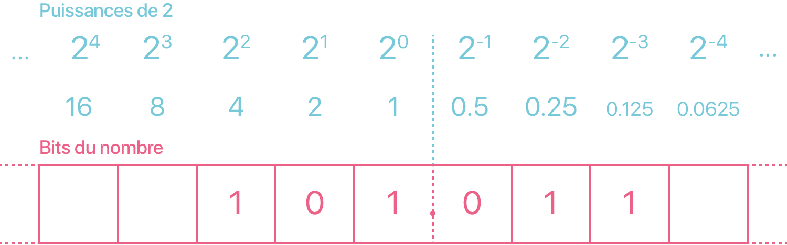

# Représentation approximative des nombres réels

Dans cette partie, nous allons comprendre l'origine de ce bug commun à quasiment tous les langages de programmation :

``` Python
>>> 0.1 + 0.2 == 0.3
False
```

Ce bug ne vient non pas du langage Python mais de la représentation en binaire des nombres à virgule, les nombres **flottants**. En python, un nombre flottant est du type `#!python float`.

## Écriture binaire

Rien ne nous empêche d'utiliser les puissances négatives de la base ! Par exemple, la décomposition suivante est naturelle en base 10 :

$$
(314.15)_{10} =
3 \times 10^2 +
1 \times 10^1 +
4 \times 10^0 + 
1 \times 10^{-1} +
5 \times 10^{-2}
$$

!!! summary "Base 2 → Base 10"
    La méthode ne change pas, la difficulté ici réside dans le calcul des puissances de 2 négatives.

    

    !!! example "Exemple"
        Que vaut $(101.011)_2$ en décimal ?

        $$
        \begin{align*}
            (101.011)_2 &= 1 \times 2^2 + 0 \times 2^1 + 1 \times 2^0 + 0\times 2^{-1} + 1 \times 2^{-2} +1 \times 2^{-2} \\
            &= 4 + 1 + 0.25 + 0.125 \\
            &= 5.375
        \end{align*}
        $$

    !!! note "Remarque 1"
        Puisque seules les puissances négatives de 2 sont des nombres à virgule en base 10, seuls les bits après la virgule contribue à la partie décimale ! Que vaudrait le nombre binaire $(0.1111111...)_2$ ?


    !!! note "Remarque 2"
        Si l'écriture en base 2 est **finie**, alors l'écriture en base 10 est également finie (car les puissances de 2 négatives sont des nombres finis en base décimale).

    !!! summary "Méthode plus rapide"
        Les puissances de 2 négatives sont difficiles à calculer. Il existe une méthode plus rapide en remarquant par exemple en base 10 que :

        $$
            1745.861 = \frac{1745861}{10^3}
        $$

        En base 2 :

        $$
            (101.011)_2 = \frac{(101011)_2}{2^3}
        $$

        On peut alors calculer le nombre binaire sans la virgule puis on divise par le bonne puissance de 2 :

        $$
            (101011)_2 =  1 + 2 + 8 + 32 = 43 \implies (101.011)_2 = \frac{43}{2^3} = 5.375
        $$

!!! summary "Base 10 → Base 2"
    Prenons le nombre $3.6875$, il se décompose en une partie entière $3$ et une partie décimale $0.6875$. On a vu précedemment que la partie décimale sera representée par des bits après la virgule. Ainsi on sait déjà que la partie entière en base binaire s'écrira $3 = (11)_2$.

    * On peut tout à fait appliquer l'algorithme de soustraction étendu aux puissances de 2 négatives afin de déterminer ces bits après la virgule :

    $$
    3.6875 = 2 + 1 + 0.5 + 0.125 + 0.0625
           = (11.1011)_2
    $$

    C'est tout de suite légèrement moins évident.

    * L'algorithme des divisions par 2 successives devient l'**algorithme des multiplications par 2 successives**. On ne s'interesse qu'à la partie décimale :

    

    $$
    \begin{align*}
    0.6875 \times 2 &= \textcolor{#ff6188}{1}.\textcolor{#71d4e2}{375} \\
    0.\textcolor{#71d4e2}{375}  \times 2 &= \textcolor{#ff6188}{0}.\textcolor{#69ba76}{75} \\
    0.\textcolor{#69ba76}{75}   \times 2 &= \textcolor{#ff6188}{1}.\textcolor{#ffd866}{5} \\
    0.\textcolor{#ffd866}{5}    \times 2 &= \textcolor{#ff6188}{1}.0
    \end{align*}
    $$

    Ainsi, on a $0.6875 = (0.\textcolor{#ff6188}{1011})_2$ et donc avec la partie entière : $3.6875 = (11.1011)_2$. Pouvez-vous expliquer pourquoi ça fonctionne ?

!!! Exemple "Exercices"
    
    1. Donner l'écriture binaire de $20.875$.

    2. Donner l'écriture binaire de $0.1$.

    3. En déduire celle de $0.2$.


!!! warning "Écritures binaires infinies"
    Un nombre ayant une **écriture décimale finie** peut avoir une **écriture binaire infinie** ! On peut voir que seul $0.5$ admet une écriture binaire finie parmi les nombres décimaux à un chiffre après la virgule (toutes les puissances négatives de 2 finissent par un 5 dans la partie décimale).

    Or la mémoire d'un ordinateur est finie. Certains nombres ne peuvent donc pas être représentés correctement en machine, c'est une impossibilité théorique.

## Précaution d'usage

Puisqu'un nombre admettant une écriture binaire infinie ne peut pas être parfaitement représenté, le nombre manipulé sur la machine est donc une **valeur approchée**. Ainsi, il faut garder en tête que les calculs sont potentiellement faux, du moins **imprécis**, lorsque des flottants interviennent.

!!! Warning "Comparaison de flottants"
    On ne teste **jamais** l'**égalité** de floattants.

    ``` python
    >>> a = 0.1
    >>> b = 0.3 - 0.2
    >>> if a == b:
            print("a et b sont égaux")
        else:
            print("a et b sont différents")

    a et b sont différents
    >>> 
    ```
    Le calcul `#!python 0.3 - 0.2` est imprécis et donnera une autre valeur approchée que `#!python 0.1`. L'opérateur d'égalité `#!python ==` vérifie en fait une égalité "bit par bit". 

    On préfère alors tester si deux nombres sont suffisamment proches, c'est-à-dire s'il existe un faible écart entre-eux. On teste alors si la différence en valeur absolue est inférieure à une précision donnée (suffisament petite) :

    ``` python
    >>> a = 0.1
    >>> b = 0.3 - 0.2
    >>> epsilon = 10 ** (-12)
    >>> if abs(a-b) < epsilon:
            print("a et b sont égaux")
        else:
            print("a et b sont différents")

    a et b sont égaux
    >>>
    ```


!!! Warning "La cumulation d'erreurs et d'imprécisions"
    Effectuer des calculs imprécis avec les flottants genèrent des **imprécisions** qui vont se **cumuler**.

    Lors de la guerre du Golfe, en 1991, les américains disposaient de systèmes d'antimissiles Patriot pour intercepter les missiles Scud irakiens. Les Patriot disposaient d'une horloge interne émettant un signal tous les $0.1$ secondes, dès leur mise sous tension. Une durée écoulée est donc : $0.1 \times$ le nombre de «tics».

    Sur ces systèmes, les nombres sont codés en virgule fixe sur 24 bits : c'est tout simplement une troncature de l'écriture binaire.

    Or $0.1 = 0.00011001100110011001100 ~|~ 1100 \ldots$

    L'erreur commise est donc d'environ $0.000000000000000000000001100 \approx 9.54 \cdot 10^{-8}$.

    Sur 100 heures de surveillance cela entraîne donc un décalage d'horloge interne de $9.54 \cdot 10^{-8} \cdot 10 \cdot 100 \cdot 3600 = 0.34$ seconde... ce qui correspond à une distance de plus de 500 mètres à la vitesse d'un missile Scud (1676 m/s).

    Ainsi un Patriot est passé à plus de 500 mètres d'un Scud le 25 février 1991 qui s'est abattu sur la caserne de Dahran et a causé ainsi la mort de 28 personnes. Une frappe chirurgicale.

## Norme IEEE-754 (Hors Programme)

### Virgule fixe

Sur certains systèmes informatiques, on utilise un codage à **virgule fixe** : on retient un nombre fixe de chiffre après la virgule (voir précédemment).

La distance entre deux nombres successifs est donc toujours la même, égale à $2^{-n}$ où $n$ est le nombre de chiffres conservés après la virgule.

Inconvénient : l’erreur relative commise sur le codage des nombres peut devenir très grande lorsque les nombres sont petits. D'où la nécessité d'un codage plus flexible.

### Virgule flottante

Pour justement s'adapter à tous les ordres de grandeur de nombres, l'idée est de coder les nombres réels dans une écriture scientifique :

$$
\pm \underbrace{1, \ldots}_{\text{mantisse } m} \times 2^e
$$

Nous avons trois informations à retenir :

* Le **signe** $\pm$.

* la **mantisse** $m$, les chiffres significatifs.

* l'**exposant** $e$. 

Deux formats les plus courants, standardisés par l'organisation IEEE :

* 32 bits : 1 bit pour le signe, 8 bits pour pour l'exposant, 23 bits pour la mantisse. Aussi appellé **simple précision**.

* 64 bits : 1 bit pour le signe, 11 bits pour l'exposant, 52 bits pour la mantisse. Aussi appellé **double précision**.

Les deux formats utilisent la même méthode pour stocker et représenter les nombres réels, on se place alors dans cas d'un flottant 32 bits sans perte de généralité.


#### Le signe

Un bit 1 indique un nombre négatif, et un bit 0 indique un nombre positif.

#### L'exposant

L'exposant $e$ est codé par un entier non-signé sur un octet décalé de 127 (on l'appelle alors l'**exposant biaisé**). Par exemple, prenons le nombre $1.010 \times 2^5$. L'exposant $e = 5$ est ajouté à 127, la somme $E = 162$, l'exposant biaisé, est representé en binaire $10100010$. D'autres exemples :

| Exposant $e$ | Exposant biaisé ($E = e + 127$) | Représentation binaire |
| ------------ | ------------------------------- | ---------------------- |
| 5            | +132                            | 10000100               |
| 0            | +127                            | 01111111               |
| -10          | +117                            | 01110101               |
| 128          | +255                            | 11111111               |
| -1           | +126                            | 01111110               |

Le décalage de 127 est nécessaire pour representer les exposants négatifs car l'entier n'est pas signé.

#### La mantisse

Avant toute chose, la mantisse doit être normalisée. C'est le même processus de normalisation en base décimale, par exemple $1234.567$ est normalisé comme $1.234567 \cdot 10^3$ de telle manière qu'il n'y a plus qu'un chiffre devant la virgule.

De la même manière, la valeur binaire $1101.101$ est normalisée comme $1.0101101 \cdot 2^3$ en décalant la virgule 3 fois vers la gauche. Quelques exemples :


| Valeur binaire | Normalisé | Exposant |
| -------------- | --------- | -------- |
| 1101.101       | 1.101101  | 3        |
| 0.00101        | 1.01      | -3       |
| 1.0001         | 1.0001    | 0        |
| 10000011.0     | 1.0000011 | 7        |

Vous avez peut-être remarqué que dans une mantisse normalisée, le chiffre 1 apparaît toujours à gauche de la virgule. En fait, le 1 initial est omis du stockage réel de la mantisse car il est non-nécessaire.

#### Conclusion

Combinons maintenant le signe, l'exposant et la mantisse normalisée pour représenter un nombre réel sur 32 bits. Quelques exemples :


| Valeur binaire  | Exposant biaisé $E$ | Signe, Exposant, Mantisse              |
| --------------- | ------------------- | -------------------------------------- |
| -1.11           | 127                 | `1  01111111  11000000000000000000000` |
| +1101.101       | 130                 | `0  10000010  10110100000000000000000` |
| -.00101         | 124                 | `1  01111100  01000000000000000000000` |
| +100111.0       | 132                 | `0  10000100  00111000000000000000000` |
| +.0000001101011 | 120                 | `0  01111000  10101100000000000000000` |

#### Cas particuliers

Il existe quelques valeurs spéciales dans ce codage IEEE 754 en simple précision. Suivant les valeurs de l’exposant biaisé $E$ (notez que le décalage vaut $2^{b-1} - 1$ où $b$  est le nombre de bits utilisés pour coder l’exposant) et de la mantisse, le nombre final peut appartenir à l'une ou l'autre des catégories suivantes :


| Type                                  | Exposant biaisé $E$ | Mantisse   |
| ------------------------------------- | ------------------- | ---------- |
| Zéros                                 | $0$                 | $0$        |
| Nombres dénormalisés                  | $0$                 | $\neq 0$   |
| Nombres normalisés                    | $1$ à $254$         | Quelconque |
| Infinis                               | $255$               | 0          |
| Nombres indéfinis (Not A Number, NaN) | $255$               | $\neq 0$   |

Un nombre dénormalisé s'écrit sous la forme $\pm \cdot 0,m \cdot 2^{-126}$.

!!! Example "Exercice 1"
    Donner la représentation IEEE 754 du nombre $3.6875$ en simple précision.

!!! Example "Exercice 2"
    Quel nombre s'écrit en virgule flottante simple précision : `11000101000000101100001101000000` ?

!!! Example "Exercice 3"
    On imagine un codage en virgule flottante sur simplement 6 bits, avec 1 bit pour le signe, 3 bits pour l'exposant et 2 pour la mantisse.
    
    On a donc $E = e + 3$.

    1. Déterminer les nombres indéfinis.
    
    2. Déterminer l'écriture de  $+\infty$ et $-\infty$.

    3. Placer sur une droite graduée les nombres normalisés positifs.

    4. Placer sur une autre droite graduée les nombres dénormalisés positifs.


