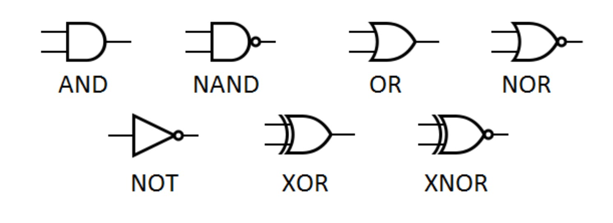

# Les valeurs booléennes

## Un peu d'histoire

**George Boole** (1815-1864) est un mathématicien et logicien britannique connu pour avoir créé la logique moderne, appelée **algèbre de Boole**.

Cette algèbre binaire n'accepte que deux valeurs, Vrai ou Faux, 0 et 1, et a donc d'importantes et nombreuses applications en informatique.

## Introduction

Pour rappel, en mathématiques, une **proposition** est une phrase qui est soit **vraie**, soit **fausse**. Par exemple, la proposition "1 plus 1 égal 11" est fausse, tandis que la proposition "7 plus 2 égal 9" est vraie. Pas les deux à la fois, c'est le principe du **tiers-exclus**.

Par exemple, que diriez-vous de ces phrases ?

* A : Vous êtes en classe de première.

* B : Antoine de Saint-Exupéry a écrit *Le Petit Prince*.

* C : La Terre est plate.

* D : $3 \cdot 4 = 12$.

* E : La lettre `#!python 'e'` est dans le mot `#!python 'abracadabra'`.

* F : Georges Perec a écrit un roman de près de 300 pages sans aucune lettre e.

* G : $2^{10} < 10^3$.

* H : La couleur orange est la plus belle des couleurs.

* I : Dieu existe.

## Algèbre de Boole

### Les booléens

L'algèbre de Boole consiste à étudier des opérations sur un ensemble uniquement constitué de deux éléments qu'on appelle **booléens**. Selon le contexte, ces deux élements sont notés :

* Faux / Vrai

* 0 / 1

*  `#!python False` / `#!python True` en Python

* :x: / :white_check_mark:

* etc.

### Les opérateurs logiques

Les opérations fondamentales sur cet ensemble de valeurs sont les opératations logiques (l'opération d'addition ou de multiplication ne fait pas sens ici). En posant $x$ et $y$ deux booléens, on a les opérations suivantes :

* La **négation**, que l'on note $\bar{x}$, ou plus simplement "NON x", `#!python not x` en Python.

* La **conjonction**, que l'on note $x \land  y$, ou plus simplement "x ET y", `#!python x and y` en Python.

* La **disjonction**, que l'on note $x \lor  y$, ou plus simplement "x OU y", `#!python x or y` en Python

Le résultat de ces opérateurs entre booléens est un booléen. On peut définir une **table de vérité** pour définir toutes les possibilités :

=== "Négation (NON)"
    | $x$ | $\bar x$ |
    | :---: | :---: |
    | :x: | :white_check_mark: |
    | :white_check_mark: | :x: |

    Ainsi, par exemple en Python :

    ``` py
    >>> not False
    True
    >>> not True
    False
    ```

=== "Conjonction (ET)"
    | $x$ | $y$ | $x \land y$ |
    | :---: | :---: | :---: |
    | :x: | :x: | :x: | 
    | :x: | :white_check_mark: | :x: | 
    | :white_check_mark: | :x: | :x: | 
    | :white_check_mark: | :white_check_mark: | :white_check_mark: |

    Ainsi, par exemple en Python :

    ``` py
    >>> True and False
    False
    >>> True and True
    True
    ```


=== "Disjonction (OU)"
    | $x$ | $y$ | $x \lor y$ |
    | :---: | :---: | :---: |
    | :x: | :x: | :x: | 
    | :x: | :white_check_mark: | :white_check_mark: | 
    | :white_check_mark: | :x: | :white_check_mark: | 
    | :white_check_mark: | :white_check_mark: | :white_check_mark: |

    Ainsi, par exemple en Python :

    ``` py
    >>> True and False
    False
    >>> True and True
    True
    ```

## Python

### Type `#!python bool` et opérateurs de comparaison

On rappelle qu'il existe un type booléen en Python `#!python bool`. Une variable de ce type ne peut prendre que deux valeurs, soit `#!python False` soit `#!python True`.

``` py
>>> type(True)
<class 'bool'>
>>> x = False
>>> x
False
>>> type(x)
<class 'bool'>
```

| Opérateur | Signification | Symbole mathématiques | 
| --- | :--- | --- |
| `#!python ==` | "est égale à" | $=$ |
| `#!python !=` | "est différent de" | $\ne$ |
| `#!python <` | "est inférieur à" | $<$ |
| `#!python <=` | "est inférieur ou égale à" | $\leq$ |
| `#!python >` | "est supérieur à" | $>$ |
| `#!python >=` | "est supérieur ou égale à" | $\geq$ |

On peut aussi rajouter l'opérateur d'appartenance `#!python in` qui renvoie un booléen :

| Opérateur | Signification | Symbole mathématiques | 
| --- | :--- | --- |
| `#!python in` | "appartient à" | $\in$ |
| `#!python not in` | "n'appartient pas à" | $\notin$ |

### Exemples

``` py
>>> a = 2
>>> a == 3
False
>>> a == 2
True
>>> a != 1
True
>>> a > 2
False
>>> a <= 5
True
>>> a % 2 == 0
True
>>> x = (0 == 1)
>>> x
False
>>> y = (3 + 2 == 5)
>>> y
True
>>> 'e' in 'abracadabra'
False
>>> 'b' in 'abracadabra'
True
>>> 'A' not in 'abracadabra'
True
>>> not True
False
>>> True and False
False
>>> True and True
True
>>> False or True
True
```

## Exercices

!!! exemple "Exercice 1 - Savoir évaluer"
    Prédire si les variables suivantes contiennent le booléen `True` ou le booléen `False` :

    ``` py
    a = (2 > 1)
    b = (3 == 1+2)
    c = (1 < 0)
    d = (2 != 5/2)
    e = (2 != 5//2)
    f = ('a' == 'A')
    g = not a
    h = b and c
    i = b or c
    j = not c and (d or e)
    ```

!!! exemple "Exercice 2 - Une table pour les gouverner tous"

    Construire la table de vérité de l'expression $(x \lor y) \land z$ où $x$, $y$ et $z$ sont trois booléens.


!!! exemple "Exercice 3 - Une formule mathématique en algèbre de Boole"

    À l'aide de tables de vérité, démontrer **les lois de De Morgan** :

    * $\overline{x \lor y} = \overline{x} \land \overline{y}$

    * $\overline{x \land y} = \overline{x} \lor \overline{y}$

    

!!! exemple "Exercice 4 - Ou Exclusif"
    Une autre opération logique importante est le **ou exclusif**, ou **disjonction exclusive**.

    C'est le sens du mot "ou" dans le langage commun. Quand on vous demande "Fromage *ou* dessert ?", c'est soit l'un, soit l'autre. Pas les deux? On note l'opérateur $\oplus$, ou `xor`. En Python, il se note `^`.
    
    Voici sa table de vérité :

    | $x$ | $y$ | $x \oplus y$ |
    | :---: | :---: | :---: |
    | :x: | :x: | :x: | 
    | :x: | :white_check_mark: | :white_check_mark: | 
    | :white_check_mark: | :x: | :white_check_mark: | 
    | :white_check_mark: | :white_check_mark: | :x: |

    * Qu'est-ce qui change par rapport à la table de vérité du ou logique ?

    * Sauriez-vous écrire $x \oplus y$ en fonctions des trois opérateurs logiques de base ?

<!-- !!! exemple "Exercice 5 - Notre premier circuit logique"

    Grâce aux transistors, on peut réaliser ce qu'on appelle des **portes logiques**, c'est-à-dire des circuits électroniques qui permettent de manipuler le courant suivant l'algèbre de Boole. 

    

     -->

## Les portes logiques 

Une partie plus ou moins hors programme. L'invention du transistor a permis de réaliser des circuits électroniques qui suivent l'algèbre de Boole, ce sont les **portes logiques**. Pour les trois opérations de base, nous en avons donc trois portes logiques :

=== "Circuit simple"
    Imaginons que j'ai un circuit composé d'un interrupteur et d'une ampoule :

    

=== "Porte NON"
    La porte NON inverse la sortie :

    

=== "Porte ET"
    

=== "Porte OU"
    


!!! note "S'amuser avec les portes logiques"
    Le site [Logic.ly](https://logic.ly/demo/) permet de tester justement toutes ces portes logiques et créer de petits circuits logiques !


!!! Exemple "Exercice 5 - Additionneur"
    1. Dresser la table de vérité de l'addition entre deux bits. Il y a deux sorties : le résultat et la retenue.

    2. Schématiser cette table sous forme d'un circuit logique à deux entrées.

    3. On veut additionner deux bits et un bit de retenue, dresser la table de vérité à trois entrées et deux sorties (bit de résulat et retenue).

    4. Schématiser cette table sous forme d'un circuit logique à trois entrées.

    5. Qu'ajouter au circuit logique précédent pour additionner deux octets entre-eux ?

## Table de Karnaugh (Hors-Programme)

Une **table de Karnaugh** est une méthode graphique pour trouver ou simplifier une fonction logique à partir de sa table de vérité. Elle utilise le **code de Gray** (aussi appelé binaire réfléchi), qui a comme propriété principale de ne faire varier qu'un seul bit entre deux mots successifs.

!!! Note "Exemple de code de Gray"
    
    * Sur 2 bits, le code de Gray est : 00, 01, 11, 10.

    * Sur 3 bits, on a : 000, 001, 011, 010, 110, 111, 101, 100.


Un tableau de Karnaugh peut être vu comme une table de vérité particulière, à deux dimensions, destinées à faire apparaître **visuellement** les simplifications possibles.

1. Par exemple, on a la table de vérité à 4 entrées, A, B, C et D :

    | A | B | C | D | Sortie |
    |:-:|:-:|:-:|:-:|:------:|
    | 0 | 0 | 0 | 0 |    **0**   |
    | 0 | 0 | 0 | 1 |    **1**   |
    | 0 | 0 | 1 | 0 |    **0**   |
    | 0 | 0 | 1 | 1 |    **1**   |
    | 0 | 1 | 0 | 0 |    **0**   |
    | 0 | 1 | 0 | 1 |    **1**   |
    | 0 | 1 | 1 | 0 |    **1**   |
    | 0 | 1 | 1 | 1 |    **1**   |
    | 1 | 0 | 0 | 0 |    **0**   |
    | 1 | 0 | 0 | 1 |    **1**   |
    | 1 | 0 | 1 | 0 |    **0**   |
    | 1 | 0 | 1 | 1 |    **1**   |
    | 1 | 1 | 0 | 0 |    **0**   |
    | 1 | 1 | 0 | 1 |    **1**   |
    | 1 | 1 | 1 | 0 |    **1**   |
    | 1 | 1 | 1 | 1 |    **1**   |

    Déterminer une formule booléenne simple ici semble complexe.

2. On dresse le tableau de Karnaugh à deux dimensions en suivant le code de Gray pour les entrées :

    | AB/CD | **00** | **01** | **11** | **10** |
    |:-----:|:--:|:--:|:--:|:--:|
    |   **00 ** |  0 |  1 |  1 |  0 |
    |   **01 ** |  0 |  1 |  1 |  1 |
    |   **11 ** |  0 |  1 |  1 |  1 |
    |   **10 ** |  0 |  1 |  1 |  0 |

3. Visuellement, on voit que si D vaut 1, alors la sortie est nécessairement à 1. On voit aussi que si B vaut 1 ET que C vaut 1 alors la sortie est nécessairement à 1.

    <div style="text-align:center"></div>

4. Ecrire la formule booléenne : $S = D \lor (B \land C)$

Pour les tables à 4 variables, de préférence procéder dans l'ordre suivant :

* le rectangle 16 cases (tout le tableau)
* les rectangles 8 cases (double colonnes/lignes)
* les rectangles 4 cases (colonne/ligne/carré)
* les rectangles 2 cases
* enfin les cases uniques.

!!! note "Exercice 6 - Quelques tables à simplifier"
    1. Dresser la table de Karnaugh et trouver la formule booléenne de :
        
        | A | B | Sortie |
        |:--:|:--:|:-----:|
        | 0 | 0 | **0** |
        | 0 | 1 | **1** |
        | 1 | 0 | **0** |
        | 1 | 1 | **1** |

    2. De même pour :

        | A | B | C | Sortie |
        |:-:|:-:|:-:|:------:|
        | 0 | 0 | 0 |** 1** |
        | 0 | 0 | 1 |** 0** |
        | 0 | 1 | 0 |** 1** |
        | 0 | 1 | 1 |** 0** |
        | 1 | 0 | 0 |** 1** |
        | 1 | 0 | 1 |** 1** |
        | 1 | 1 | 0 |** 1** |
        | 1 | 1 | 1 |** 1** |

    3. Et un dernier pour la route :

        | A | B | C | D | Sortie |
        |:-:|:-:|:-:|:-:|:------:|
        | 0 | 0 | 0 | 0 | **1** |
        | 0 | 0 | 0 | 1 | **0** |
        | 0 | 0 | 1 | 0 | **1** |
        | 0 | 0 | 1 | 1 | **0** |
        | 0 | 1 | 0 | 0 | **0** |
        | 0 | 1 | 0 | 1 | **1** |
        | 0 | 1 | 1 | 0 | **0** |
        | 0 | 1 | 1 | 1 | **1** |
        | 1 | 0 | 0 | 0 | **1** |
        | 1 | 0 | 0 | 1 | **0** |
        | 1 | 0 | 1 | 0 | **1** |
        | 1 | 0 | 1 | 1 | **0** |
        | 1 | 1 | 0 | 0 | **0** |
        | 1 | 1 | 0 | 1 | **0** |
        | 1 | 1 | 1 | 0 | **0** |
        | 1 | 1 | 1 | 1 | **0** |

!!! note "Exercice 7 - Décodeur 7 segments"
    Un afficheur 7 segments est un composant électronique qui permet d'afficher des motifs graphiques, notamment des chiffres :

    <div style="text-align:center;"></div>

    Il est composé de 7 segments lumineux désignés par les lettres A à G :
    <div style="max-width: 150px; text-align:center;"></div>

    Soit 4 entrées $e_3, e_2, e_1$ et $e_0$ représentant un chiffre. Par exemple : l'entrée 1001 représente le chiffre 9. 
    
    1. Dresser la table de vérité pour le segment D et E.

    2. Pour chacune de ces tables, dresser la table de Karnaugh et déterminer la formule booléene associée.

    3. Sur un même schéma (mêmes entrées $e_0, e_1, e_2$ et $e_3$), représenter ces deux formules booléennes par des portes logiques. 
