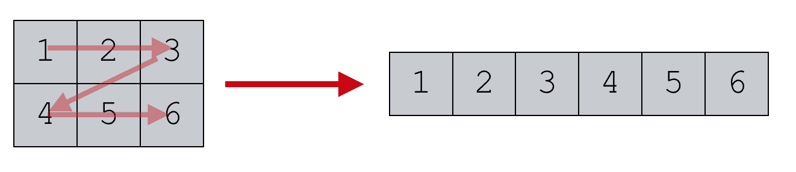

# Tableaux à plusieurs dimensions

## Listes de listes

Nous avons vu qu'une liste pouvait contenir des éléments de tous types : des entiers, des chaines des caractères... et pourquoi pas une liste qui contient des listes ?

On obtient alors un tableau à deux dimensions, qui est semblable au concept mathématique de matrice.


La liste ```tab``` ci-dessous est composée de 3 listes qui elles-mêmes contiennent trois nombres :
```python
tab =  [[3, 5, 2],
        [7, 1, 4], 
        [8, 6, 9]]
```

On accède aux *lignes* du tableau avec un simple crochet:

```python 
>>> tab[1]
[7, 1, 4]
```

Et aux éléments par un double crochet:

```python 
>>> tab[2][1]
6
```

<figure markdown>
  { width="300" }
  <figcaption></figcaption>
</figure>

## Parcourir une liste de listes

* Parcours par éléments :
    ```python 
    for ligne in tab:
        for element in ligne:
            print(element)
    ```

* Parcours par indice :
    ```python 
    for i in range(3):
        for j in range(3):
            print(tab[i][j])
    ```


## Exercices

!!! example "Exercice 1"
    === "Énoncé"
        On considère le jeu du Morpion (ou *Tic-Tac-Toe*) dont la surface de jeu vierge est representée par le tableau :  
        ```python
         tab = [[' ', ' ', ' '], [' ', ' ', ' '], [' ', ' ', ' ']]
        ``` 

        Les premiers coups joués sont ceux-ci :

        - ```tab[1][1] = 'X'``` 
        - ```tab[2][1] = 'O'``` 
        - ```tab[2][2] = 'X'``` 
        - ```tab[0][0] = 'O'``` 

        Quel coup doit maintenant jouer le joueur  `'X'` pour s'assurer la victoire ?

    === "Correction"
        <!-- {{ correction(True,
        "
        ```python
        tab[0][2] = 'X'
        # ou
        tab[1][2] = 'X'
        ```
        "
        ) }} -->

!!! example "Exercice 2"
    === "Énoncé"
        On considère la liste ```m``` (`m` comme *matrice*) suivante :  

        ```python
        m = [[1, 9, 4], [4, 1, 8], [7, 10, 1]]
        ```  

        Ecrire le programme qui réaliser la somme de tous les élements de la matrice ```m```.

    === "Correction"
        <!-- {{ correction(True,
        "
        ```python linenums='1'
        m = [[1, 9, 4], [4, 1, 8], [7, 10, 1]]

        somme = 0
        for ligne in m:
            for elt in ligne:
                somme += elt

        print(somme)
        ```
        "
        ) }} -->

!!! example "Exercice 3"
    On peut aussi utiliser un seul tableau pour représenter une matrice, en l'"applatissant" (*flatten* en anglais) :

     <figure markdown>
    { width="500" }
    <figcaption></figcaption>
    </figure>

    Cette représentation est très utilisée en programmation bas niveau car plus performante.

    1. Comment écrire la matrice `m` de manière aplatie ?
        ```python
        m = [[1, 8, 9, 4], [4, 1, 9, 8], [7, 3, 10, 1]]
        m_flat = ...
        ```  

    2. Comment accéder à l'élement `10` de la matrice `m` ? Et `m_flat` ?
        ```python
        >>> m[...][...]
        10
        >>> m_flat[...]
        10
        ```  

    3. Plus généralement, si je veux accéder à l'élement `m[ligne][colonne]` de la matrice `m_flat`, quel indice devrais-je utiliser ?