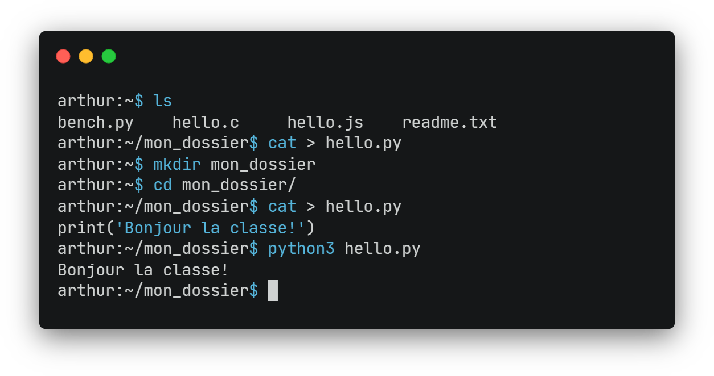

# TP Shell 



La rédaction du document réponse Capytale est en cours... notez vos réponses dans un fichier texte pour l'instant.

## Introduction :material-console:

Les premiers systèmes d'exploitation étaient dépourvus d'interface graphique. Il n'y avait pas de fenêtres ni de curseur de souris pour interagir avec l'ordinateur. Au lieu de cela, les utilisateurs devaient communiquer avec le système d'exploitation en utilisant des **lignes de commandes**, qui sont du texte saisi via un programme appelé **shell**. Le Shell est une <b>interface</b> entre le noyau et l'utilisateur :

<figure markdown>
{ width=200 }
{ width=200 }
</figure>

Le shell permet à l'utilisateur d'exécuter des commandes et des scripts pour interagir avec le système d'exploitation (exécuter des programmes, gérer des fichiers et des répertoires, contrôler les processus en cours etc.). Le shell est toujours disponible dans les OS actuels et encore très utilisé de nos jours. On se propose dans ce TP de découvrir les commandes de base du shell.

??? note "Différence entre shell et terminal"
    Le **terminal** et le **shell** sont souvent confondus dans le langage courant.

    * Le **terminal** est un programme permet à l'utilisateur de **saisir des commandes** et de les exécuter en mode texte,
    sans avoir besoin d'une interface graphique. Il exécute par défaut un shell.

    * Le **shell** est le programme qui s'exécute à l'intérieur du terminal et qui **interprète** les commandes saisies par l'utilisateur et qui permet d'interagir avec le système d'exploitation.

    Comme il n'est généralement pas possible d'interagir avec le shell sans utiliser un terminal, les deux termes sont confondus. Le terminal est l'interface du shell qui est l'interface du noyau qui est l'interface du matériel. Vous suivez ?

## L'arborescence des dossiers et des fichiers :material-family-tree:

Dans les systèmes d'exploitation basés sur UNIX (par exemple Linux ou macOS), nous avons un système de fichiers et de dossiers en arborescence :


### Chemins absolus

On peut accéder à n'importe quel dossier ou fichier grâce à un **chemin**. Par exemple, `/home/joel/images/photo1.jpg` permet d'accéder au fichier `photo1.jpg`. Quand le chemin part de le **racine** `/`, on parle de **chemin absolu**.

### Chemins relatifs

On peut aussi accéder à un fichier ou à un dossier grâce à un **chemin relatif**. Par exemple, si l'on **se situe** dans le dossier `/home/joel`, on peut accéder à `luge.mp4` grâce au chemin relatif `./images/ski/luge.mp4` : `.` fait référence au répertoire (dossier) **courant**. Il est d'ailleurs facultatif.

Il est courant aussi de vouloir revenir en arrière. Par exemple, si l'on se situe dans le dossier `/home/joel` et que l'on souhaite accéder à `rapport.txt`, on écrit alors `../ellie/documents/rapport.txt` : `..` fait référence au répertoire **parent**.

??? question "Questions 1"
    1. Quel est le chemin absolu pour accéder au fichier `hello.py` ? 
    
    2. On se situe dans le dossier `travail` de ce fichier `hello.py`. Quel est alors le chemin relatif à ce répertoire pour accéder à `photo1.jpg` ? 

## Les commandes de base :material-console:

Découvrons les commandes UNIX les plus courantes grâce à au petit jeu [Terminux](http://luffah.xyz/bidules/Terminus/) ! Prêt pour l'aventure ?

<figure markdown>
[{ width=200 .wiggle }](http://luffah.xyz/bidules/Terminus/)
[{ width=200 .wiggle }](http://luffah.xyz/bidules/Terminus/)
</figure>

Dans ce jeu, les différents **lieux** correspondent à des **dossiers** et les différents **objets et personnages** à des **fichiers** !

??? question "Questions 2"
    Au fur et à mesure de l'aventure :

    1. Noter les **commandes** découvertes et leur fonction :

        | Nom de la commande | Description                     | Utilisation                                                              |
        | ------------------ | ------------------------------- | ------------------------------------------------------------------------ |
        | `ls`               | Lister le contenu d'un dossier. | `ls` puis ++enter++ pour lister </br>les fichiers du répertoire courant. |
        | ...                | ...                             | ...                                                                      |

    2. Remplir aussi le tableau des **raccourcis claviers** :

        | Nom de la commande | Description |
        | ------------------ | ----------- |
        | ++up++  ++down++   | ...         |
        | ++tab++            | ...         |

    3. Réaliser le plan du jeu de manière **collaborative** ! 

        
        

        Le lien du diagramme partagé est [disponible ici](https://drive.google.com/file/d/1H8hnVY5u4CxBjOosMU2_zL_8lOb2tAIa/view?usp=sharing). Il faudra alors vous connectez à votre compte Google du lycée @lyceecivray.net et ouvrir le fichier avec l'application Diagrams. Veuillez respecter le **code couleur** (copier-coller simplement les nœuds du diagramme) !

## Compléments sur les commandes

### Un vrai terminal !

Comme Windows diffère des autres systèmes d'exploitation qui sont majoritairement basés sur Unix, son langage de shell est relativement peu utilisé. Ainsi, nous opterons plutôt pour l'émulation d'un système d'exploitation Linux en utilisant [JSLinux](https://bellard.org/jslinux/vm.html?url=alpine-x86.cfg&mem=192), un émulateur proposé par Fabrice Bellard. Merci Fabrice.

??? question "Questions 3"
    Dans le document réponse, veuillez bien inscrire les différentes commandes que vous avez utilisées pour répondre aux questions.

    1. En inscrivant la bonne commande dans le shell, dans quel dossier sommes-nous quand le système démarre ? Donner son chemin absolu. 

    2. Que **contient** ce dossier ?

    3. Que **contient** le fichier `readme.txt` ?

    4. **Créer** le dossier `programmes` (grâce à la commande `mkdir nom_du_dossier`) et y **déplacer** les 3 fichiers correspondants à des programmes. Sauriez-vous déplacer ces 3 fichiers en une seule ligne de commande ?

    5. Se **déplacer** dans ce nouveau répertoire et y **créer** un fichier vide `bonjour.py` grâce à la commande `touch nom_du_fichier`.
   
    6. Modifier ce programme Python pour qu'il affiche un message de bienvenue. Pour cela on utilisera l'éditeur **nano** (`nano nom_du_fichier`) : ++ctrl+o++, ++enter++ pour enregistrer le programme puis ++ctrl+x++ pour quitter l'éditeur. Exécuter le programme ainsi crée grâce au programme `python` (`python nom_du_fichier_py`).

    7. Dans le répertoire initial (`#!shell cd ~`), qu'affiche la commande `tree` ?
       Note : Ne faites pas cette commande à la racine du système `/` ( ++ctrl+c++ pour stopper une commande en cours si jamais).

### Les options et les arguments

Les lignes de commande que l'on a écrites jusqu'à présent étaient de la forme : 

```sh
$ nom_de_la_commande argument1 argument2 ...
```

Le nombre d'arguments est variable, par exemple :

* `ls` ne prend aucun argument.

* `cd` prend un chemin en argument.

* `mv` prend plusieurs arguments : les noms des fichiers à déplacer et un répertoire de destination.

On peut paramétrer plus finement une commande grâce à des **options**. Une option s'écrit de deux manières : `--option` ou `-o`. La syntaxe courte ne possède qu'un caractère ! Toute ligne de commande s'écrit comme :

```sh
$ nom_de_la_commande --option1 --option2 ... argument1 argument2 ...
```


??? question "Questions 4"
    1. Dans le dossier où se situent les différents fichiers des programmes, exécuter la commande `#!shell ls -l`. Que fait l'option `-l` ?

    2. En utilisant l'option `--help` ou `-h` qui permet de lire une description rapide d'une commande, **donner l'option** qui permet de **trier** la liste des fichiers affichée par `ls`  par ordre décroissant de taille.

    3. Exécuter alors `ls` avec cette nouvelle option dans le répertoire des programmes. Donner le résultat affiché.

## La gestion des droits et permission d'accès aux fichiers :material-file:

### Introduction

Si on exécute `ls -l` dans le dossier parent : 

```sh-system
localhost:~# ls -l
total 8
drwxr-xr-x    2 root     root           111 Mar 28 17:35 programmes
-rw-r--r--    1 root     root           151 Jul  5  2020 readme.txt
```

Si l'on arrive à distinguer **à droite**, le nom du fichier/dossier `readme.txt`, la date de dernière modification  `Jul  5  2020` et le poids du fichier/dossier `151` (en octets), la partie **à gauche** reste légèrement cryptique ! Un autre exemple sur ma machine :


La correspondance des quatres champs à gauche est la suivante :

```
drwxr-xr-x      2      arthur    arthur 
     ↑          ↑         ↑         ↑
  Droits     #Liens  Utilisateur  Groupe
```

Nous allons voir à quoi correspond ces différents champs, excepté `#Liens` le nombre de liens, qui n'est pas au programme.

### `Utilisateur`

Un système UNIX est **multi-utilisateur**, chaque utilisateur (personne physique ou un programme) est identifié par un **nom** et un **identifiant unique (UID)**, et possède un ensemble de **droits** qui déterminent les opérations qu'il peut effectuer sur le système, telles que l'accès à un fichier ou à un dossier, l'exécution de programmes, etc.


??? question "Questions 5"
    1. Pour connaître les utilisateurs du système, on consulte le fichier `/etc/passwd`. Que contient ce fichier ?

        Les utilisateurs sont enregistrés au format : `nom:motdepasse:UID:GID:informations:repertoire:shell`

    2. Vous êtes l'utilisateur `root`. Quel est votre UID ?

??? note "Je suis root !"
    L'utilisateur `root` est en fait le **super-utilisateur** du système qui a tous les pouvoirs sur le système ! Pour exécuter une commande réservée au super-utilisateur, un utilisateur lambda doit utiliser la commande `sudo` (super user do) qui nécessite de connaître le mot de passe root qui en général n'est connu que de l'administrateur du système.

    <figure markdown>
    
    </figure markdown>


### `Groupe`

Chaque utilisateur est associé à un ou plusieurs **groupes**. Ils permettent de regrouper des utilisateurs pour leur attribuer des droits d'accès communs aux fichiers ou applications.

??? question "Question 6"
    Le fichier qui stocke les différents groupes se situe dans le même répertoire que précédemment, sauriez-vous le retrouver ? Que contient-il ?

### Les types d'utilisateurs `ugo`

Avec ces notions d'utilisateurs et de groupes, chaque fichier distingue alors **trois types d'utilisateurs** :

| Utilisateur             | Anglais | Symbole |
| ----------------------- | ------- | ------- |
| Son propriétaire        | User    | `u`     |
| Un groupe associé       | Group   | `g`     |
| Les autres utilisateurs | Others  | `o`     |


### `Droits`

Il existe trois **droits** concernant un fichier ou un répertoire :

| Droit             | Anglais   | Symbole | Description                                                                                        |
| ----------------- | --------- | ------- | -------------------------------------------------------------------------------------------------- |
| Droit de lecture  | Read      | `r`     | Il est possible de **lire** le contenu du fichier                                                  |
| Droit d'écriture  | Write     | `w`     | Il est possible de **modifier** le contenu du fichier                                              |
| Droit d'exécution | eXecution | `x`     | Il est possible d'**exécuter** le contenu du fichier</br>(quand le fichier est du code exécutable) |

Chaque fichier se voit ainsi attribuer pour chaque type d'utilisateurs (propriétaire, groupe, autres) leurs droits correspondants. Toutes ces informations sont encodées dans le champ `Droits`, par exemple :

```
-rwxr-xr--
```

Le champ `Droits` s'écrit sur 10 caractères :

* Le 1er caractère `-` ou `d` indique s'il s'agit d'un fichier ou d'un répertoire

* Les 9 caractères suivants représentent dans l'ordre les droits `rwx` pour les 3 types d'utilisateurs dans l'ordre `ugo`.

Par exemple, la séquence `-rwxr-xr--` se décompose comme :

```text
-    r  w  x    r  -  x    r  -  -
    └-- u --┘  └-- g --┘  └-- o --┘
```

<figure markdown>
| Type d'utilisateur |      Droit lecture</br>`r`       |      Droit écriture</br>`w`      |     Droit exécution</br>`x`      |
| -----------------: | :------------------------------: | :------------------------------: | :------------------------------: |
|   Propriétaire `u` | :fontawesome-solid-square-check: | :fontawesome-solid-square-check: | :fontawesome-solid-square-check: |
|   Groupe       `g` | :fontawesome-solid-square-check: |    :fontawesome-solid-xmark:     | :fontawesome-solid-square-check: |
|   Autres       `o` | :fontawesome-solid-square-check: |    :fontawesome-solid-xmark:     |    :fontawesome-solid-xmark:     |
</figure>


### Modification des droits avec `chmod`

Seuls le propriétaire et l'utilisateur root peuvent modifier les droits d'un fichier ou d'un répertoire grâce à la commande `chmod` (de l'anglais *change mode*).

Elle s'utilise ainsi, en précisant l'utilisateur (`a` pour tous), l'ajout `+` ou la suppression `-` ou la réinitialisation `=` de la permission et enfin les droits :

```
chmod [u g o a] [+ - =] [r w x] nom_du_fichier
```

Par exemple,

```
chmod g+w bulletin.txt
```

attribuera la permission de modifier le fichier au groupe associé au fichier `bulletin.txt`

??? question "Questions 7"
    Dans le document réponse, veuillez bien inscrire les différentes commandes que vous avez utilisées pour répondre aux questions.

    1. Créer un fichier vide `test.txt` avec la commande `touch`.

    2. Quels sont les permission actuelles du fichier ? 

    3. Changer les permissions du fichier pour que tout le monde ait les permissions de lecture et d'écriture.

    4. Finalement non, enlevez les droits à ces gueux d'utilisateurs `o` !