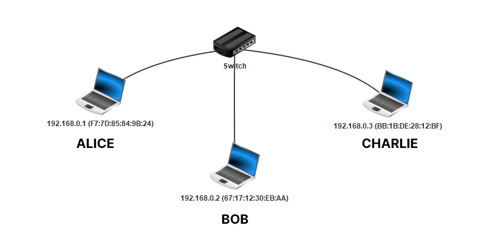
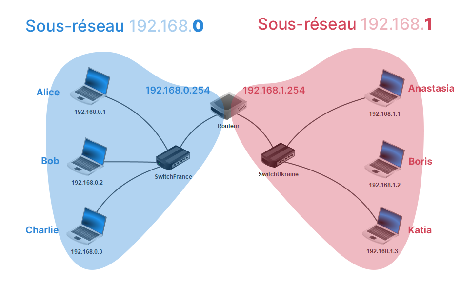

# TP Filius

!!! info "Filius"
    **Filius** est un logiciel qui permet de simuler un réseau informatique. Si les ordinateurs de la région n'autorisent pas l'installation de logiciels non approuvés, on peut toutefois les exécuter en version « portable ». Copier le fichier `filius.zip` depuis l'espace NSI dans votre espace personnel et décompressez-le. Il suffira d'exécuter `Lancer Filius.bat`.

!!! info "Document Réponse Capytale"
    Le TP est en cours de rédaction, le document réponse Capytale aura un peu de retard. Notez vos réponses au différentes questions (Bloc-Notes) pour les copier plus tard. 


## Un réseau local

!!! success "Objectif"
    L'objectif de cette partie est de comprendre comment le **switch** achemine les **trames** d'un nœud source vers le bon nœud de destination grâce aux adresses MAC.

### Un premier réseau

* Dans Filius, réaliser le réseau suivant. Cocher « Utiliser l'adresse IP comme nom » et « Utiliser l'adresse MAC comme nom ». Veuillez à bien définir les adresses IP des hôtes.

<figure markdown>
{ width=829 }
</figure>

* A travers ce TP, on associe aux différentes machines un utilisateur :

<center>

| Utilisateur |  Adresse IP   |
| :---------: | :-----------: |
|    Alice    | `192.168.0.1` |
|     Bob     | `192.168.0.2` |
|   Charlie   | `192.168.0.3` |

</center>

* Lancer la simulation.

* Définir la vitesse de la simulation à 1%.

### Avant l'envoie de données sur le réseau

* Cliquer le switch pour révéler sa table interne SAT avant l'envoie de données sur le réseau.

* Cliquer sur le premier hôte `192.168.0.1` (Alice). Installer le logiciel **Ligne de commande** sur cette machine et exécuter-le.

??? question "Questions 1"
    1. Que vaut la table SAT du switch ?

    1. Que renvoie la commande `ipconfig` ?
    
    2. Que renvoie la commande `arp` ?

### Après l'envoie de données sur le réseau local

* Réaliser un **ping** de Alice `192.168.0.1` vers Charlie `192.168.0.3` grâce à la commande `ping 192.168.0.3`.
  
??? question "Questions 2"

    1. Que vaut maintenant la table SAT du switch ? À quoi sert-elle ?

    2. Que renvoie maintenant la commande `arp` ? À quoi sert la table ARP ?

    3. Que renvoie la commande `arp` sur l'hôte de destination Charlie `192.168.0.3` ? Et Bob `192.168.0.2` ?


### Où est Charlie ?

**Avant le premier ping, les différents hôtes et le switch n'ont aucune connaissance du réseau local auquel ils sont connectés.** Ainsi quand Alice envoie un message à Charlie, elle ne connaît pas encore l'adresse MAC de ce dernier. Quelle adresse MAC de destination doit-elle inscrire sur la trame qu'elle envoie sur le réseau ?

Elle envoie simplement un message à **tout le monde** sur le réseau local pour trouver Charlie ! C'est ce que l'on appelle une **diffusion générale**, ou un **broadcast**.

??? info "Analyse de la découverte du réseau"
    1. **Alice génère une trame :** Alice fait une demande de ping, le message est « *Bonjour Bob, c'est Alice, ceci est un ping. Renvoie-moi un message.* ». Le protocole TCP encapsule ce message dans un segment, puis le protocole IP encapsule ce segment TCP dans un paquet IP. Ce paquet est enfin encapsulé dans une trame Ethernet.

    2. ** En-tête de la trame** : Sur la trame qu'elle envoie sur le réseau, Alice y inscrit l'adresse MAC de destination `FF:FF:FF:FF:FF:FF`, c'est **l'adresse de diffusion générale (broadcast)**.
      
    3. **Réception par le switch** : Le switch reçoit la trame broadcast d'Alice et la diffuse sur tous ses autres ports, à Bob et à Charlie donc. Par ailleurs, il enregistre dans sa table SAT l'adresse MAC d'Alice (l'adresse MAC source de la trame) en y associant le port où Alice est connectée.

    4. **Réception par Bob** : Bob reçoit la trame broadcast depuis le switch. Il la décapsule en un paquet et regarde l'adresse IP de destination. Ce n'est pas la sienne, donc il ignore le paquet.

    5. **Réception par Charlie** : Charlie reçoit la trame broadcast et la décapsule, l'adresse IP de destination indiquée sur le paquet est la sienne. Il décapsule enfin le paquet jusqu'à lire le message d'Alice « *Bonjour Bob, c'est Alice, ceci est un ping. Renvoie-moi un message.* ». Il note aussi l'adresse MAC d'Alice dans sa table ARP. 

    6. **Charlie génère une trame** : Charlie renvoie donc un message à Alice. Il y inscrit l'adresse IP d'Alice sur le paquet et son adresse MAC sur la trame.

    7. **Réception par le switch** : La trame de Charlie passe tout d'abord par le switch. Ce dernier ajoute l'adresse MAC de Charlie dans sa table ARP. Le switch connaît l'adresse MAC d'Alice, donc il aiguille la trame sur le bon port. 

    8. **Réception par Alice** : Alice reçoit le message de Charlie et note son adresse MAC dans sa table ARP.

??? info "En vidéo"
    N'hésitez pas à faire pause à chaque étape :

    <div class="video-wrap">
    <div class="video-container">
        <iframe src="https://peertube.lyceeconnecte.fr/videos/embed/d073c76d-b2ad-4bb9-8e74-90179cf14623" frameborder="0" allowfullscreen="1"></iframe>
    </div>
    </div>

<!-- <iframe title="Découverte du réseau local par une machine" width="560" height="315" src="https://peertube.lyceeconnecte.fr/videos/embed/d073c76d-b2ad-4bb9-8e74-90179cf14623" frameborder="0" allowfullscreen="" sandbox="allow-same-origin allow-scripts allow-popups"></iframe> -->

??? question "Questions 3"

    1. Quelles sont les adresses MAC source et de destination inscrit dans l'en-tête dans la première trame envoyée par Alice ?

    2. Cette trame encapsule un paquet. Quelles sont les adresses IP source et de destination inscrit dans l'en-tête de ce paquet ? 

    3. Comment Charlie sait alors que cette trame lui est destinée ?

    4. Comment Bob sait que cette trame ne lui est pas destinée ?

    5. Quelles sont les adresses MAC source et de destination inscrit dans l'en-tête dans la trame envoyée par Charlie ? Et les adresses IP source et de destination du paquet encapsulé dans la trame ?

    6. Est-ce que le switch décapsule les trames qu'il reçoit ? C'est-à-dire, regarde-t-il les adresses IP du paquet contenu dans la trame ? Change-t-il les adresses MAC source/destination de la trame ? 

    7. Est-ce que les différents hôtes, Alice, Bob et Charlie décapsulent les trames qu'ils reçoivent ?

    8. Que se passe-t-il si Alice envoie un ping à l'adresse IP `192.168.0.4` dans la simulation (remettre la vitesse de simulation à 100%) ? 


## :fontawesome-solid-network-wired: Sous-réseaux

!!! success "Objectif"
    L'objectif de cette partie est de comprendre comment la notion de **sous-réseaux** : la division d'un réseau en plusieurs sous-groupes.

### Une introduction

* Renommer le switch en « SwitchFrance ». Créer un second réseau de trois machines d'adresses IP `192.168.1.1`, `192.168.1.2` et `192.168.1.3` avec un « SwitchUkraine ». Relier les deux switchs.

<center>

| Utilisateur |  Adresse IP   |
| :---------: | :-----------: |
|  Anastasia  | `192.168.1.1` |
|    Boris    | `192.168.1.2` |
|    Katia    | `192.168.1.3` |

</center>

??? question "Questions 4"

    1. Tester un ping de `192.168.0.1` (Alice) vers `192.168.1.2` (Boris). Que se passe-t-il?

    2. Renommer la machine `192.168.1.2` (Boris) en `192.168.0.4` et retenter le ping. Que se passe-t-il?

### Masque de sous-réseau

Lorsqu'une machine A veut envoyer un message à une machine B, elle doit déterminer si cette machine :

* **appartient au même sous-réseau** : auquel cas le message est envoyé directement via un ou plusieurs switchs.

* **n'appartient pas au même sous-réseau** : auquel cas le message doit d'abord transiter par un routeur (voir plus loin).

La notion de sous-réseau n'est pas topologique — *il ne suffit pas de relier physiquement les dispositifs entre eux* — mais obéit à des règles **numériques**. C'est le **masque de sous-réseau** (parfois simplement *masque*, ou *netmask* en anglais) qui permet de déterminer quelles adresses font partie d'un même sous-réseau.

### Adresse IP et masque de sous-réseau

Une adresse IP est codée sur 4 octets (32 bits) et peut être coupé en deux :

* **L'adresse du réseau** : les $k$ premiers bits

* **L'adresse du réseau** : les $32 - k$ bits restants.

=== "Exemple 1"
    * Par défaut, le masque de Filius est `255.255.255.0`, soit en binaire `11111111.11111111.11111111.00000000`.

    * Donc $k = 24$. On note souvent l'adresse IP d'Alice comme `192.168.0.1 /24`

    * Suivant ce masque, 256 machines peuvent donc appartenir au même sous-réseau (ce n'est pas tout à fait le cas car des adresses finissant par 0 ou par 255 sont réservées).

    * Deux machines appartiennent a un même sous-réseau si elles partagent donc les 24 premiers bits, c'est à dire les 3 premiers nombres (octets). Ainsi Alice est dans le sous-réseau « `192.168.0` ».

=== "Exemple 2"
    * Soit le masque `255.255.248.0`, en binaire `11111111.11111111.11111000.00000000`.
    
    * Donc $k = 21$. L'adresse IP d'Alice se note `192.168.0.1 /21`.

    * Deux machines appartiennent au même sous-réseau si elles partagent les 21 premiers bits de leur adresse IP.


??? question "Question 5"

    Dans l'exemple 2, combien de machines peuvent appartenir à ce même sous-réseau ?

### Appartenance à un même sous-réseau

Pour que deux machines appartiennent à un même sous-réseau, il faut donc que leurs adresses IP respectives partagent les mêmes $k$ premiers bits définis par le masque.

Pour cela, on extrait les $k$ premiers bits correspondant au sous-réseau d'une adresse IP quelconque grâce l'opération du **ET logique bit à bit** (*bitwise and* en anglais) que l'on note `&` pour le différencier du ET logique usuel `&&`. On effectue le calcul `Adresse IP & Masque`. Par exemple :

```
• Adresse IP :  192.168.1.2    =  11000000.10101000.00000001.00000010
• Masque     :  255.255.248.0  =  11111111.11111111.11111000.00000000

• Adresse IP & Masque :

    11000000.10101000.00000001.00000010  ◀  Adresse IP
 &  11111111.11111111.11111000.00000000  ◀  Masque
 ───────────────────────────────────────────
    11000000.10101000.00000000000000000  ◀  Sous-réseau
```

Comme vous pouvez le constater, les bits à `0` **masque** la partie inférieure de l'adresse IP !

??? question "Question 6"

    On considère trois hôtes A, B et C aux adresses IP respectives `192.168.129.10`, `192.168.135.200` et `192.168.145.1` configurées avec le masque de sous-réseau `255.255.248.0`. Remplir le tableau :
    
    <center>

    | Machines | Adresse IP        | Masque          | Adresse IP & Masque |
    | :------: | :---------------- | :-------------- | :------------------ |
    |    A     | `192.168.129.10`  | `255.255.248.0` |                     |
    |    B     | `192.168.135.200` | `255.255.248.0` |                     |
    |    C     | `192.168.145.1`   | `255.255.248.0` |                     |

    </center>

## :material-router: Le routeur

!!! success "Objectif"
    L'objectif de cette partie est de comprendre comment le **routeur** interconnecte deux sous-réseaux en routant les paquets.

!!! idea "Fichier Filius"
    Si vous n'avez pas sauvegardé votre réseau, [téléchargez ce fichier](images/start_routeur.fls).

Comment faire pour que le sous-réseau « France » communique avec le sous-réseau « Ukraine » ? Comment interconnecter les deux sous-réseaux conçus précédemment ? Grâce à un équipement de la couche 3 (couche réseau), le **routeur**. Ce dispositif, parfois appelé **passerelle**, est équipé de deux cartes réseaux (chacune ayant une adresse physique MAC et une adresse logique IP) ou plus.

<figure markdown>
{ width=600 }
</figure>

1. En mode conception :fontawesome-solid-hammer:, **ajouter un routeur** à deux interfaces et le relier aux deux switchs. Si vous ne l'avez pas déjà fait, supprimer le câble entre les deux switchs.

    > Pourquoi deux interfaces ? Il faut bien une carte réseau par sous-réseau !

2. **Configurer le routeur** :
    * Son interface reliée au « SwitchFrance » doit appartenir au sous-réseau « France ». Donc on doit configurer son adresse IP sous la forme `192.168.0.XXX` (on conserve le masque par défaut `255.255.255.0`).
    
    > Généralement, on donne une adresse finissant par `254` (`255` étant réservé pour effectuer un ping l'intégralité d'un sous-réseau).
  
    * Faire de même pour la deuxième interface du routeur.

    * Sélectionner « Routage automatique » dans l'onglet « Général ».

    <figure markdown>
    { width=500 }
    </figure>

3. En mode simulation :fontawesome-solid-play: , tester un `ping` depuis la machine `192.168.0.1` (Alice) vers `192.168.1.1` (Anastasia). Que se passe-t-il ?


    > La carte réseau d'Alice ne sait pas où envoyer les paquets car l'adresse IP d'Anastasia ne fait pas parti de son sous-réseau. Alice ne sait pas non plus qu'il existe un routeur (passerelle) dans son sous-réseau.

4. En mode configuration :fontawesome-solid-hammer:, cliquer sur la machine d'Alice et lui **renseigner la passerelle** de son sous-réseau. Retenter le ping.
   
    > Le ping se termine en `timeout` ? Il ne faut pas oublier qu'un *ping* renvoie un écho *pong*... 

5. Une fois qu'Alice et Anastasia peuvent communiquer, effectuer un `traceroute` pour afficher le nombre de sauts nécessaires.


??? question "Questions 7"
    Exécuter l'invite de commandes de Windows : ++win+r++ puis `cmd` puis ++enter++.

    1. Grâce à la commande `ipconfig /all`, donner l'adresse IP et MAC de la carte réseau du PC.

    2. Donner aussi l'adresse IP de la passerelle par défaut.

    3. Afficher aussi la table ARP grâce à la commande `arp -a`. Quelle est l'adresse MAC de la passerelle ?

    4. `traceroute` devient `tracert` sous Windows. L'adresse IP du serveur Web [www.lyceecivray.net](www.lyceecivray.net) est `188.130.25.202`. Combien faut-il de sauts pour y parvenir depuis votre poste ?


## :material-web: Un serveur Web

!!! success "Objectif"
    Après avoir étudié les trois premières couches du modèle OSI (à savoir, la couche physique, la couche liaison de données et la couche réseau), nous allons maintenant nous concentrer sur la couche 4 (transport), où se trouve le protocole TCP, ainsi que sur les couches 5 et supérieures (application), où réside le protocole HTTP.

!!! idea "Fichier Filius"
    Si vous n'avez pas sauvegardé votre réseau, [téléchargez ce fichier](images/start_webserver.fls).

> Si envoyer des pings sur le réseau est intéressant, envoyer de réelles données sur le réseau l'est encore plus !

Maintenant que nous avons relié deux machines situées dans deux sous-réseaux différents, nous obtenons un modèle réduit d'Internet. On peut désormais simuler le service Web avec échange client/serveur.

1. En mode configuration :fontawesome-solid-hammer:, connecter un ordinateur au « SwitchUkraine », il s'agira de notre serveur Web. Configurer correctement la machine :
   
    * Lui donner une adresse IP du sous-réseau (`192.168.1.10` par exemple).
  
    * Ne pas oublier de lui renseigner la passerelle.

2. En mode simulation :fontawesome-solid-play:, installer un serveur Web sur cette nouvelle machine et le démarrer.
    
    > Par défaut, Filius génère une page HTML `index.html`. En installant un éditeur de texte, vous pouvez modifier cette page web.

3. Installer un navigateur Web sur la machine d'Alice `192.168.0.1`. Dans la barre d'adresse, y inscrire l'adresse IP du serveur. Une page devrait s'afficher.

    > Que s'est-il passé ? Le navigateur web d'Alice a généré une requête HTTP (de type `GET`) qu'elle envoie au serveur Web. Le serveur reçoit la requête et renvoie le fichier `index.html` au navigateur Web d'Alice qui l'affiche.

4. Pour avoir le détail des échanges de données entre les deux machines, faites clique-droit sur la machine d'Alice `192.168.0.1` et « Afficher les échanges de données ».

<figure markdown>
{ width=500 }
</figure>

??? question "Questions 8"

    Trouver la requête HTTP `GET` qu'Alice a envoyée au serveur. Dans le détail de cette requête, on peut identifier les quatre couches Réseau, Internet, Transport et Application qui constituent les différents en-têtes.

    1. A quel dispositif correspond l'adresse IP de destination du paquet envoyée par Alice ? 

    1. A quel dispositif correspond l'adresse MAC de destination de la trame envoyée par Alice ?

    2. Que fait le routeur lorsqu'il reçoit la trame contenant la requête d'Alice au niveau des adresses MAC ?

        > On remarque en bleu clair des échanges qui suivent tous les échanges HTTP (bleu foncé), en regardant de plus près on s'aperçoit qu'il s'agit d'un simple segment TCP avec le commentaire `ACK`. Il ne contient pas de données.

    3. Juste après la requête GET d'Alice, quelle machine émet le segment `ACK` ? Qui la reçoit ? 

    4. De même après la réponse du serveur contenant les données de la page `index.html`, quelle machine émet le segment `ACK` ? Qui la reçoit ? 

    5.  D’après vos connaissances sur le protocole TCP, quel rôle peut bien jouer ce segment ?

    6.  TCP a aussi le rôle d'initialiser et terminer la connexion entre Alice et le serveur Web. Repérer les trames TCP marquant le début et la fin de connexion. Compléter le diagramme suivant (sur Paint par exemple) :

    <figure markdown>
    { width=500 }
    </figure>
